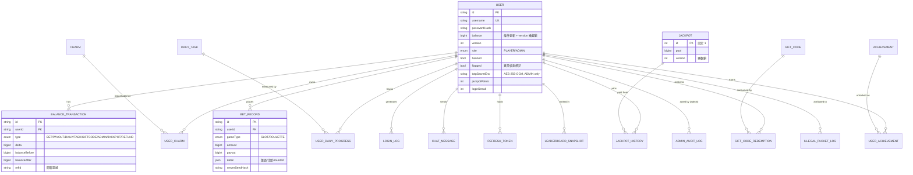

# 資料庫設計書：ER Diagram 與 Prisma Schema 草案
**專案：Virtual Casino Sandbox｜版本 v1.0｜PostgreSQL 16（dev 可 SQLite）｜Prisma Migrate 管理**

---

## 0. 核心約束（先讀）

> **所有餘額扣款在程式邏輯中必須使用「條件更新」並檢查受影響行數，配合樂觀鎖防止超扣：**
> ```sql
> UPDATE users SET balance = balance - :amount, version = version + 1
> WHERE id = :userId AND balance >= :amount;
> ```
> Prisma 寫法：`prisma.user.updateMany({ where: { id, balance: { gte: amount } }, data: { balance: { decrement: amount }, version: { increment: 1 } } })` → 檢查 `count === 1`，否則在交易內拋錯回滾。
> **任何模組不得繞過 `wallet` 模組直接動 `balance`；每次異動必伴隨一筆 `BalanceTransaction`（含 before/after），可全帳回放。**

其他全域約定：
- 金額一律 `BigInt`（最小單位 1 Coin），全系統禁止浮點。
- 主鍵用 `cuid()`（避免自增 ID 被枚舉）。
- 高頻寫入表（BetRecord、BalanceTransaction、IllegalPacketLog）不設外鍵 CASCADE 刪除，僅 RESTRICT——對帳資料永不級聯消失。
- `Jackpot` 與 `User` 帶 `version` 欄位作樂觀鎖。
- MATERIALIZED VIEW（leaderboard_daily/weekly/total）不進 Prisma schema，由 raw SQL migration 建立（PG 專屬，SQLite 環境跳過）。

---

## 1. ER Diagram（Mermaid）


（其餘表結構詳見 §2 Prisma Schema，欄位以 Schema 為準。）

### 1.1 表格清單（17 張）
| # | 表 | 職責 | # | 表 | 職責 |
|---|---|---|---|---|---|
| 1 | User | 帳號、餘額(樂觀鎖)、角色、封鎖 | 10 | LoginLog | 登入紀錄（IP/UA/結果） |
| 2 | RefreshToken | 旋轉式 refresh、重用偵測 | 11 | ChatMessage | 聊天（7 天保留） |
| 3 | BalanceTransaction | 全帳異動流水（永久） | 12 | LeaderboardSnapshot | 每日 Top100 快照（永久） |
| 4 | BetRecord | 下注/賠付明細（永久） | 13 | DailyTask | 任務模板池 |
| 5 | Charm | 護符模板（效果 JSON） | 14 | UserDailyProgress | 玩家每日任務進度 |
| 6 | UserCharm | 玩家持有/裝備狀態 | 15 | AdminAuditLog | 後台操作審計（永久） |
| 7 | Jackpot | 單行獎池（樂觀鎖，永久） | 16 | IllegalPacketLog | 非法封包/簽章失敗紀錄 |
| 8 | JackpotHistory | 派彩歷史（永久） | 17 | Announcement | 公告/活動 |
| 9 | GiftCode（+GiftCodeRedemption） | 兌換碼與核銷 | 18 | Achievement / UserAchievement | 成就 |

---

## 2. Prisma Schema 草案（`backend/prisma/schema.prisma`）

```prisma
generator client {
  provider = "prisma-client-js"
}

datasource db {
  provider = "postgresql"          // dev 環境可切 "sqlite"
  url      = env("DATABASE_URL")
}

// ─────────────────────────── Enums ───────────────────────────
enum Role            { PLAYER ADMIN }
enum GameType        { SLOT ROULETTE }
enum TxType          { BET PAYOUT DAILY_REWARD TASK_REWARD GIFT_CODE ADMIN_ADJUST JACKPOT REFUND }
enum CharmType       { WEIGHT RULE CONDITIONAL PITY BONUS }
enum CharmRarity     { COMMON RARE EPIC LEGENDARY }
enum TaskType        { SPIN_COUNT ROULETTE_ROUNDS WIN_TRIPLE NET_WIN CHAT_COUNT }
enum LeaderboardKind { DAILY WEEKLY TOTAL }
enum LoginResult     { SUCCESS WRONG_PASSWORD BANNED TOTP_FAILED }
enum PacketViolation { BAD_SIGNATURE NONCE_REPLAY SEQ_REGRESSION STALE_TIMESTAMP OUT_OF_WINDOW RATE_LIMIT }

// ─────────────────────────── 核心 ───────────────────────────
model User {
  id            String   @id @default(cuid())
  username      String   @unique @db.VarChar(20)
  passwordHash  String                                  // argon2id
  role          Role     @default(PLAYER)
  balance       BigInt   @default(5000)                 // 新手禮包；只准 wallet 模組條件更新
  version       Int      @default(0)                    // 樂觀鎖
  banned        Boolean  @default(false)
  muted         Boolean  @default(false)
  flagged       Boolean  @default(false)                // 異常偵測標記
  avatarId      Int      @default(0)
  jackpotPoints Int      @default(0)
  pityCounter   Int      @default(0)                    // 主要使用 Redis 計數；此欄位僅供備份還原或每日結算時同步，一般旋轉不寫入
  loginStreak   Int      @default(0)
  lastDailyAt   DateTime?
  totpSecretEnc String?                                 // AES-256-GCM，僅 ADMIN
  totpEnabled   Boolean  @default(false)
  recoveryCodes String?                                 // 雜湊後 JSON 陣列
  createdAt     DateTime @default(now())
  updatedAt     DateTime @updatedAt

  transactions  BalanceTransaction[]
  bets          BetRecord[]
  charms        UserCharm[]
  loginLogs     LoginLog[]
  chats         ChatMessage[]
  dailyProgress UserDailyProgress[]
  jackpotWins   JackpotHistory[]
  redemptions   GiftCodeRedemption[]
  refreshTokens RefreshToken[]
  achievements  UserAchievement[]
  snapshots     LeaderboardSnapshot[]

  @@index([flagged])
  @@map("users")
}

model RefreshToken {
  id         String   @id @default(cuid())
  userId     String
  tokenHash  String   @unique                            // sha256(token)
  familyId   String                                      // 旋轉鏈；重用偵測 → 全家族撤銷
  revoked    Boolean  @default(false)
  expiresAt  DateTime
  createdAt  DateTime @default(now())
  user       User     @relation(fields: [userId], references: [id])

  @@index([userId, familyId])
  @@map("refresh_tokens")
}

model BalanceTransaction {
  id            String   @id @default(cuid())
  userId        String
  type          TxType
  delta         BigInt                                   // 正負皆可
  balanceBefore BigInt
  balanceAfter  BigInt
  refId         String?                                  // BetRecord/GiftCode/AuditLog id
  memo          String?  @db.VarChar(200)
  createdAt     DateTime @default(now())
  user          User     @relation(fields: [userId], references: [id])

  @@index([userId, createdAt])
  @@index([type, createdAt])
  @@map("balance_transactions")
}

model BetRecord {
  id             String   @id @default(cuid())
  userId         String
  gameType       GameType
  amount         BigInt
  payout         BigInt   @default(0)
  detail         Json
  // SLOT: { reels: ["CHERRY","LEMON","LUCKY7"], charmsUsed: ["clover_boost"], pityActive: false, luckySymbol: "CLOVER" }
  // ROULETTE: { roundId: "xxx", bets: [{ type: "RED", amount: 50 }] }
  roundId        String?                                 // 輪盤回合
  serverSeedHash String                                  // provably-fair 預留
  createdAt      DateTime @default(now())
  user           User     @relation(fields: [userId], references: [id])

  @@index([userId, createdAt])
  @@index([gameType, createdAt])
  @@index([roundId])
  // migration 補：CREATE INDEX ... USING BRIN (created_at) — 物化視圖刷新用
  @@map("bet_records")
}

// ─────────────────────────── 護符 ───────────────────────────
model Charm {
  id          String      @id @default(cuid())
  code        String      @unique                        // "CLOVER_BOOST_30"
  name        String      @db.VarChar(40)
  description String      @db.VarChar(200)
  type        CharmType
  rarity      CharmRarity
  effect      Json        // WEIGHT: {symbol,reels:[1,2,3],multiplier:1.3}
                          // CONDITIONAL: {trigger:{reel12:"LUCKY7"},variant:{reel:3,symbol:"LUCKY7",multiplier:3}}
                          // RULE: {wildSubstitute:true} / PITY: {threshold:10,bonus:0.5} / BONUS: {onSymbol:"DIAMOND",jackpotPoints:100}
  enabled     Boolean     @default(true)
  createdAt   DateTime    @default(now())
  owners      UserCharm[]

  @@map("charms")
}

model UserCharm {
  id         String   @id @default(cuid())
  userId     String
  charmId    String
  equipped   Boolean  @default(false)
  slot       Int?                                        // 1..3；equipped=true 時必填
  obtainedAt DateTime @default(now())
  user       User     @relation(fields: [userId], references: [id])
  charm      Charm    @relation(fields: [charmId], references: [id])

  @@unique([userId, charmId])
  @@unique([userId, slot])                               // 一槽一符
  @@index([userId, equipped])
  @@map("user_charms")
}

// ─────────────────────────── Jackpot ───────────────────────────
model Jackpot {
  id        Int      @id @default(1)                     // 單行表，永遠 id=1
  pool      BigInt   @default(0)                         // 真值；Redis 僅存未落庫增量
  version   Int      @default(0)                         // 樂觀鎖：UPDATE ... WHERE version=:v
  updatedAt DateTime @updatedAt
  history   JackpotHistory[]

  @@map("jackpot")
}

model JackpotHistory {
  id         String   @id @default(cuid())
  jackpotId  Int      @default(1)
  userId     String
  poolBefore BigInt
  payout     BigInt                                      // 80%
  remained   BigInt                                      // 20% 留底
  createdAt  DateTime @default(now())
  jackpot    Jackpot  @relation(fields: [jackpotId], references: [id])
  user       User     @relation(fields: [userId], references: [id])

  @@index([createdAt])
  @@map("jackpot_history")
}

// ─────────────────────────── Gift Code ───────────────────────────
model GiftCode {
  id          String   @id @default(cuid())
  code        String   @unique @db.VarChar(32)           // ≥16 字元 CSPRNG base32
  amount      BigInt
  charmId     String?                                    // 可附贈護符
  maxUses     Int      @default(1)                       // 初版恆 1（單次使用）
  usedCount   Int      @default(0)
  expiresAt   DateTime                                   // 必填：時效性
  createdById String                                     // Admin
  createdAt   DateTime @default(now())
  redemptions GiftCodeRedemption[]

  @@index([expiresAt])
  @@map("gift_codes")
}

model GiftCodeRedemption {
  id         String   @id @default(cuid())
  giftCodeId String
  userId     String
  createdAt  DateTime @default(now())
  giftCode   GiftCode @relation(fields: [giftCodeId], references: [id])
  user       User     @relation(fields: [userId], references: [id])

  @@unique([giftCodeId, userId])                         // DB 層防同人重複兌換
  @@map("gift_code_redemptions")
}

// ─────────────────────────── 紀錄與日誌 ───────────────────────────
model LoginLog {
  id        String      @id @default(cuid())
  userId    String?                                      // 帳號不存在時為 null
  username  String      @db.VarChar(20)
  ip        String      @db.VarChar(45)
  userAgent String      @db.VarChar(255)
  result    LoginResult
  createdAt DateTime    @default(now())
  user      User?       @relation(fields: [userId], references: [id])

  @@index([userId, createdAt])
  @@index([ip, createdAt])
  @@map("login_logs")
}

model ChatMessage {
  id        String   @id @default(cuid())
  userId    String?                                      // null = 系統訊息
  content   String   @db.VarChar(200)                    // 已過濾 URL、已轉義
  system    Boolean  @default(false)
  createdAt DateTime @default(now())
  user      User?    @relation(fields: [userId], references: [id])

  @@index([createdAt])                                   // 7 天清理排程用
  @@map("chat_messages")
}

model LeaderboardSnapshot {
  id        String          @id @default(cuid())
  kind      LeaderboardKind
  periodKey String?         @db.VarChar(10)              // DAILY/WEEKLY 使用日期或週編號；TOTAL 為 NULL
  rank      Int
  userId    String
  score     BigInt
  createdAt DateTime        @default(now())
  user      User            @relation(fields: [userId], references: [id])

  @@unique([kind, periodKey, rank])
  @@index([userId])
  @@map("leaderboard_snapshots")
}

// ─────────────────────────── 每日系統 ───────────────────────────
model DailyTask {
  id          String   @id @default(cuid())
  code        String   @unique                           // "SPIN_20"
  name        String   @db.VarChar(40)
  type        TaskType
  target      Int                                        // 目標值（20 次、5 局…）
  rewardCoin  BigInt   @default(0)
  rewardCharm Boolean  @default(false)                   // 是否給護符抽取
  enabled     Boolean  @default(true)
  progress    UserDailyProgress[]

  @@map("daily_tasks")
}

model UserDailyProgress {
  id        String    @id @default(cuid())
  userId    String
  taskId    String
  dateKey   String    @db.VarChar(10)                    // "2026-06-11"（Asia/Taipei）
  progress  Int       @default(0)
  claimed   Boolean   @default(false)
  claimedAt DateTime?
  user      User      @relation(fields: [userId], references: [id])
  task      DailyTask @relation(fields: [taskId], references: [id])

  @@unique([userId, taskId, dateKey])
  @@index([dateKey])
  @@map("user_daily_progress")
}

// ─────────────────────────── 管理與安全 ───────────────────────────
model AdminAuditLog {
  id           String   @id @default(cuid())
  adminId      String
  action       String   @db.VarChar(40)                  // "ADJUST_BALANCE" / "BAN_USER" / "CREATE_GIFTCODE"
  targetUserId String?
  before       Json?
  after        Json?
  ip           String   @db.VarChar(45)
  createdAt    DateTime @default(now())

  @@index([adminId, createdAt])
  @@index([targetUserId])
  @@map("admin_audit_logs")
}

model IllegalPacketLog {
  id        String          @id @default(cuid())
  userId    String?
  ip        String          @db.VarChar(45)
  violation PacketViolation
  endpoint  String          @db.VarChar(80)
  rawSample String?         @db.VarChar(1024)            // payload 截斷 1KB
  createdAt DateTime        @default(now())

  @@index([userId, createdAt])
  @@index([violation, createdAt])
  @@map("illegal_packet_logs")
}

model Announcement {
  id        String   @id @default(cuid())
  title     String   @db.VarChar(60)
  content   String   @db.VarChar(500)
  active    Boolean  @default(true)
  startsAt  DateTime @default(now())
  endsAt    DateTime?
  createdAt DateTime @default(now())

  @@index([active, startsAt])
  @@map("announcements")
}

// ─────────────────────────── 成就 ───────────────────────────
model Achievement {
  id          String  @id @default(cuid())
  code        String  @unique                            // "FIRST_TRIPLE"
  name        String  @db.VarChar(40)
  description String  @db.VarChar(120)
  rewardCoin  BigInt  @default(0)
  unlocks     UserAchievement[]

  @@map("achievements")
}

model UserAchievement {
  id            String      @id @default(cuid())
  userId        String
  achievementId String
  unlockedAt    DateTime    @default(now())
  user          User        @relation(fields: [userId], references: [id])
  achievement   Achievement @relation(fields: [achievementId], references: [id])

  @@unique([userId, achievementId])
  @@map("user_achievements")
}
```

---

## 3. Raw SQL Migration 附錄（不進 Prisma schema）

```sql
-- 物化視圖（PG 專屬；SQLite 環境由 migration script 跳過）
CREATE MATERIALIZED VIEW leaderboard_daily AS
  SELECT user_id, SUM(payout - amount) AS net_win
  FROM bet_records
  WHERE created_at >= date_trunc('day', now() AT TIME ZONE 'Asia/Taipei')
  GROUP BY user_id ORDER BY net_win DESC LIMIT 100;
CREATE UNIQUE INDEX leaderboard_daily_uid ON leaderboard_daily(user_id);
-- weekly / total 同構，total 直接以 users.balance 排序建視圖

-- BRIN 索引：壓低視圖刷新與歷史查詢成本
CREATE INDEX bet_records_created_brin ON bet_records USING BRIN (created_at);
CREATE INDEX balance_tx_created_brin  ON balance_transactions USING BRIN (created_at);

-- 種子資料：jackpot 單行
INSERT INTO jackpot (id, pool, version) VALUES (1, 0, 0) ON CONFLICT DO NOTHING;
```

---

## 4. 關鍵存取模式對照表
| 場景 | 路徑 | 一致性手段 |
|---|---|---|
| 老虎機旋轉 | 1 個 PG 交易：條件扣款 → 寫 BetRecord → 賠付 credit → 寫兩筆 Tx | READ COMMITTED + 條件更新 |
| Jackpot 累積 | Redis INCRBY（交易外，丟失容忍 ≤10s 增量） | 原子操作 + 定時 flush |
| Jackpot 派彩 | 強制 flush → 單交易 + version 樂觀鎖（重試 ≤3） | 樂觀鎖 |
| Gift Code 兌換 | 交易：`UPDATE gift_codes SET used_count=used_count+1 WHERE id=:id AND used_count<max_uses AND expires_at>now()` 檢查行數 → 寫 Redemption（unique 雙保險）→ credit | 條件更新 + 唯一鍵 |
| 排行榜讀取 | 直查物化視圖 | 5 分鐘最終一致 |
| 護符裝備 | 交易更新 UserCharm → 重編譯 loadout → 覆寫 Redis | 快取以 DB 為準重建 |
